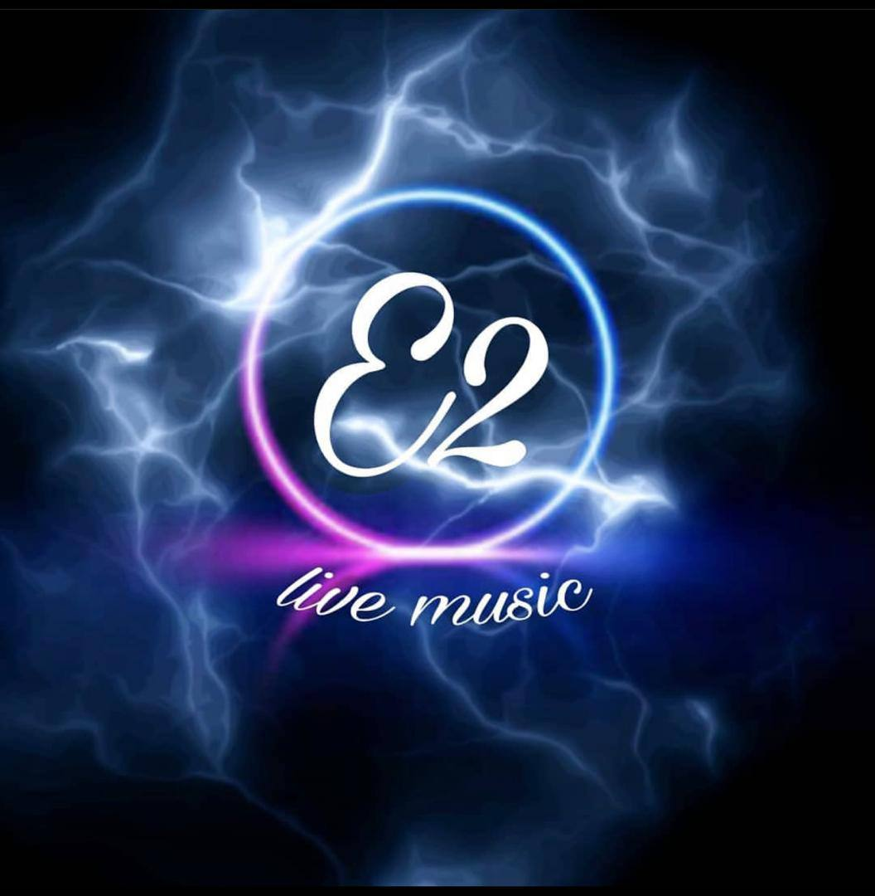

# E2 Live Music - Premium Landing Page

  

## 📌 Overview

**E2 Live Music** is a high-performance, modern landing page designed and developed for a premium live music orchestra. Built with a focus on elegant aesthetics, fluid animations, and mobile-first responsiveness, this project serves as a showcase of advanced front-end development capabilities within the **Quorex Studio** portfolio.

## ✨ Key Features

- **Modern UI/UX Design**: Implementation of glassmorphism, dynamic gradients, and smooth scroll behaviors to create an immersive user experience.
- **Custom Design System**: Scalable and maintainable CSS architecture using CSS Custom Properties (Variables) for theming and consistent spacing.
- **Advanced Mobile Navigation**: Custom-built, performant right-side drawer menu with backdrop filtering and scroll-lock management, ensuring a native-app feel on mobile devices.
- **Zero-Dependency Architecture**: Built entirely with Vanilla HTML5, CSS3, and JavaScript, ensuring maximum performance, zero bloat, and instantaneous load times.
- **Intersection Observer Animations**: Elements reveal smoothly as they enter the viewport, enhancing the visual storytelling without compromising performance.

## 🛠️ Technology Stack

- **HTML5**: Semantic and accessible markup.
- **CSS3**: Advanced features including Grid, Flexbox, Transitions, Transforms, and CSS Variables.
- **Vanilla JavaScript**: Lightweight DOM manipulation, event handling, and Intersection Observers.

## 🚀 Development & Architecture Highlights

- **Responsive Strategy**: Fluid typography and layout adaptations from large desktop displays down to 320px mobile screens.
- **Performance Optimization**: No heavy frameworks. The entire page renders instantly.
- **Clean Code Practices**: Modular CSS structure with clear sections for Reset, Variables, Layout, Components, and Media Queries.

## 💼 About Quorex Studio

This project was developed by **Quorex Studio** as part of our ongoing commitment to delivering premium, high-converting web experiences. It demonstrates our capability to translate brand identity into functional, pixel-perfect digital products without relying on heavy external libraries.

---
*Developed by [Quorex Studio](https://github.com/Quorex-Studio)*
